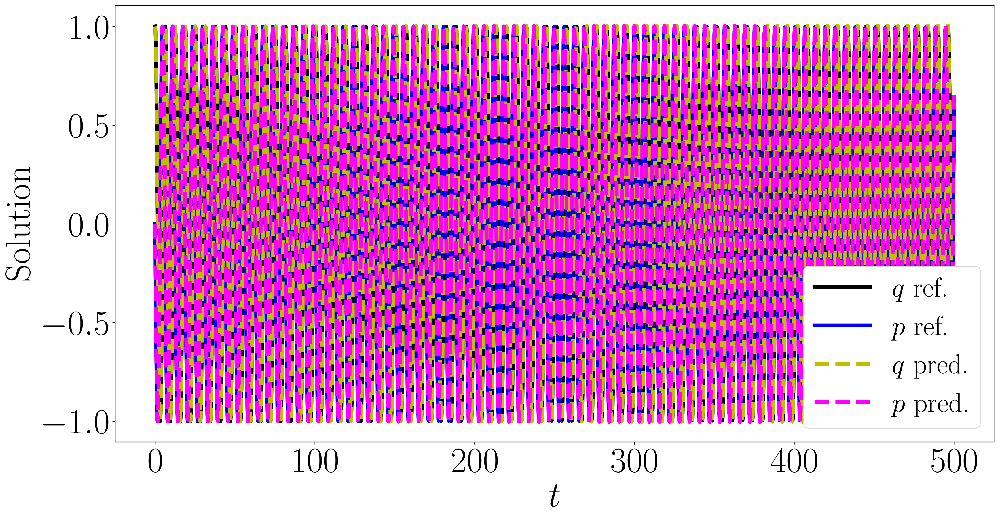
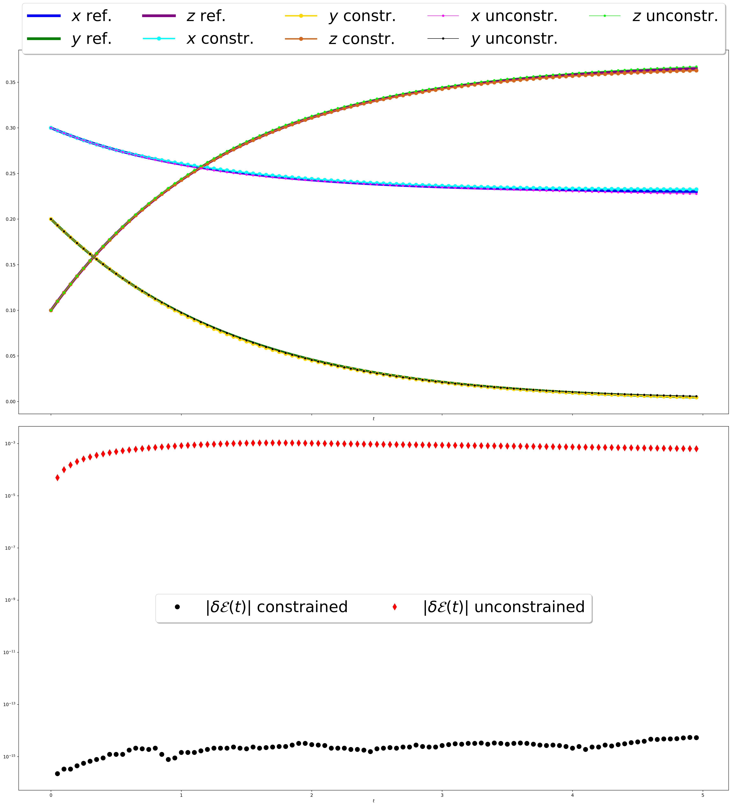

# Examples for the Introduction to the PhD Thesis

This repository contains five directories. Each of these corresponds to one of the numerical experiments included in the introduction of the PhD thesis. 

To install the required dependencies, run the commands
>
>
>

The codes are reasonably commented, and they mostly come from simplifications of the code used for the papers included in the thesis. 

Here is a brief description of the four directories:
  
### Free rigid body with Lie Euler

The directory titled [freeRigidBody](freeRigidBody) includes a Jupyter notebook [Main Notebook](freeRigidBody/main.ipynb) where the explicit Euler method is compared with the Lie Euler method in solving the equations of motion of a free rigid body. The equations are
$
\dot{\mathbf{x}}(t) = \begin{bmatrix} x_2(t)x_3(t)\frac{I_2-I_3}{I_2I_3} \\ -x_1(t)x_3(t)\frac{I_1-I_3}{I_1I_3} \\ x_1(t)x_2(t)\frac{I_1-I_2}{I_1I_2}\end{bmatrix},\,\,\mathbf{x}(t) = [x_1(t),x_2(t),x_3(t)].
$
The considered initial condition is $\mathbf{x}(0) = [\cos{(0.1)},0,\sin{(0.1)}]$ and the inertia parameters are $I_1=2$, $I_2=1$ and $I_3=2/3$.

The code is a simplified version of the code available at the repository https://github.com/davidemurari/learningConstrainedHamiltonians

The obtained plot is:

### Approximating the flow map of an harmonic oscillator

The focus here is on the ODEs for a harmonic oscillator, which write
$\begin{cases}
\dot{q}(t)=p(t)\\
\dot{p}(t)=-q(t)
\end{cases}.$
We train a neural network to solve the problem for a collection of initial conditions in the box $[-1,1]^2\subset\mathbb{R}^2$, and for $t\in [0,1]$. Then, the model is deployed on the wider time intervals $[0,T=100]$ and $[0,T=500]$.The reported plots correspond to the initial condition $[q(0),p(0)]=[1,0]$.

The directory titled [harmonicOscillator](harmonicOscillator) includes the following:
- [savedPlots](harmonicOscillator/savedPlots) folder : this is where the generated plots are saved after the code is run
- [scripts](harmonicOscillator/scripts) folder : this folder contains the Python scripts to run the code, which are:
    - [networks](harmonicOscillator/scripts/networks.py) : this script contains the definition of the neural network architecture we use.
    - [plotting](harmonicOscillator/scripts/plotting.py) : this script contains the plotting routines to get the plots for energy conservation and the qualitative behaviour of the solution
    - [training](harmonicOscillator/scripts/training.py) : this script includes the routine to train a neural network so it approximates the flow map of a harmonic oscillator for a suitable set of initial conditions and on the time interval $[0,\Delta t]$
    - [utils](harmonicOscillator/scripts/utils.py) : this script contains some utils to define the ODE for the harmonic oscillator, and define the loss function based on the ODE residual
- [trainedModels](harmonicOscillator/trainedModels) folder : this folder contains some pre-trained models, and it is where the newly trained ones are saved too
- [main](harmonicOscillator/main.ipynb) notebook : this notebook aims to call the proper scripts and generate the plots in the introduction, also reported here.

### Parareal solver based on neural networks for the SIR model

Here we focus on the equations defining the SIR model for a specific choice of parameters. The equations we consider write
$\begin{bmatrix}
    \dot{x}(t) \\ 
    \dot{y}(t) \\ 
    \dot{z}(t) \\
\end{bmatrix}=\begin{bmatrix} -x(t)y(t)\\ x(t)y(t)-y(t) \\y(t) \end{bmatrix}=:\mathcal{F}(x(t),y(t),z(t)).$
The directory associated to this experiment, where we use the Parareal method based on neural network coarse propagators, is [pararealSIR](pararealSIR). 

The directory has a sub-directory [ELM](pararealSIR/ELM/) where the scripts based on a coarse propagator which is an Extreme Learning Machine (ELM) are collected. In the sub-directory [flowMapNetwork](pararealSIR/flowMapNetwork/) we instead collect the code for a coarse propagator based on a similar procedure as the one followed for the harmonic oscillator above. The structure of this second sub-directory is essentially the same of the one for the harmonic oscillator, with a few additional scripts that also belong to the ELM sub-directory and we now describe.

Here is the structure of the ELM directory:
- [savedPlots](pararealSIR/ELM/savedPlots/) : this is the folder where the plots obtained while running the experiments are stored
- [savedReports](pararealSIR/ELM/savedReports/) : this is the folder where a .txt file associated to the run is saved. This file describes the results of the run, in terms of timings and parameters.
- [scripts](pararealSIR/ELM/scripts/) : this folder collects the scripts for the main experiment. We briefly comment on them:
    - [dynamics](pararealSIR/ELM/scripts/dynamics.py) : this script contains some utils to define the ODE for the SIR plroblem, and define the loss function based on the ODE residual
    - [ode_solvers](pararealSIR/ELM/scripts/ode_solvers.py) : this script contains the definition of the ODE solver we use as fine propagator, i.e., a Runge--Kutta method of order 4.
    - [parareal](pararealSIR/ELM/scripts/parareal.py) : this scripts contains the procedure to apply the Parareal iterations, while training the ELMs as coarse propagators. The solutions to the involved optimisation problems are provided by Scipy solvers.
    - [plotting](pararealSIR/ELM/scripts/plotting.py): this script produces a plot of the obtained solution over the required time interval. This will be the plot of a piecewise smooth function, since over the intervals $[t_n,t_{n+1})$, with $t_n=n\,\Delta t$, the solution produced by the ELM is plotted, while at the discretisation points $t_n$ the solution is corrected with the parareal step, hence it is in principle discontinuous.
    - [repeated_experiment](pararealSIR/ELM/scripts/repeated_experiments.py) : this scripts is used to repeat the experiment of applying the proposed hybrid Parareal method a certain amount of times. This is of interest so we can compute average computational costs, hence being able to analyse a method which in principle is stochastic.
    - [utils](pararealSIR/ELM/scripts/utils.py) : this scripts contains methods that allow to define a coarse propagator as an ELM. We use these methods to train and define the coarse propagator, but also to obtain the evaluation of the coarse solver over a given time vector.
- [main](pararealSIR/ELM/main.ipynb) : this notebook repeats the Parareal iterates 100 times, produces files that store the obtained computational costs, and also the plot of the produced solution for one choice of parameters.

We report here the plots for the two choices of coarse propagators, highlighting the benefit of using an ELM as a coarse propagator compared with a more conventional neural network, which would also take about 20 minutes to train.

#### Plot with coarse propagator which is an ELM

#### Plot with coarse propagator which is based on the Flow map approach

### Mass preserving SIR model

The directory [Mass Preserving SIR model](MassPreservingSIRmodel) again is interested in the SIR model. Here, instead of solving its equations, we want to approximate the flow map $\Phi_{\mathcal{F}}^{0.05}$, based on observed trajectory segments.

We provide a brief description of the files included in the directory, and conclude with the plot also present in the introduction.

- [generateData](MassPreservingSIRmodel/generateData.py) : this scripts allows to get the trajectory segments based on the number of time instants to consider and the final time value. 
- [main](MassPreservingSIRmodel/main.ipynb) : this notebook includes the definition of the two neural network architectures, the lines of code to train them and to display the obtained results. 
- [unconstrainedNet](MassPreservingSIRmodel/unconstrainedNet.pt) : this is the saved model for the unconstrained neural network.
- [constrainedNet](MassPreservingSIRmodel/constrainedNet.pt) : this is the saved model for the constrained neural network.

The code is a simplified version of the code available at the repository https://github.com/davidemurari/StructuredNeuralNetworks 

